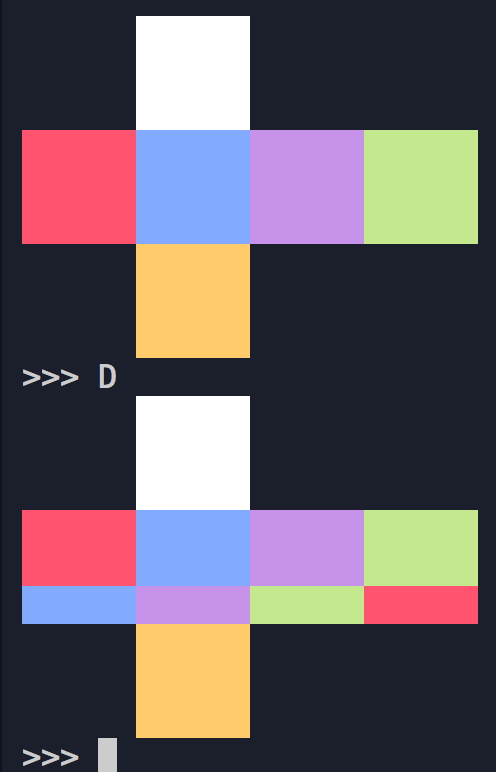

# python-cube
Rubix cube with Python3

## U, U', U2

### U
- `Cube.U(clockwise=True)`
- `U` command in program
- Rotates the upper face 90 degrees clockwise

### U'
- `Cube.U(clockwise=False)`
- `U'` command in program
- Rotates the upper face 90 degrees counterclockwise

## U2
- Call `U` twice
- `U2` command in program

## D

### D
- `Cube.D(clockwise=True)`
- `D` command in program
- Rotates the bottom face 90 degrees clockwise

### D'
- `Cube.D(clockwise=False)`
- `D'` command in program
- Rotates the bottom face 90 degrees counterclockwise

### D2
- Call `D` twice
- `D2` command in program
